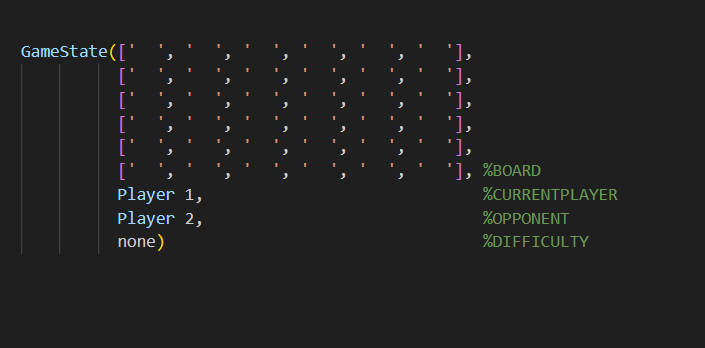
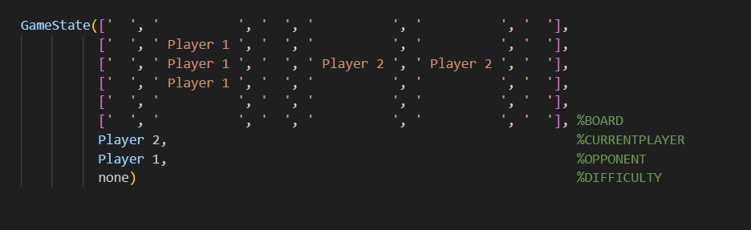
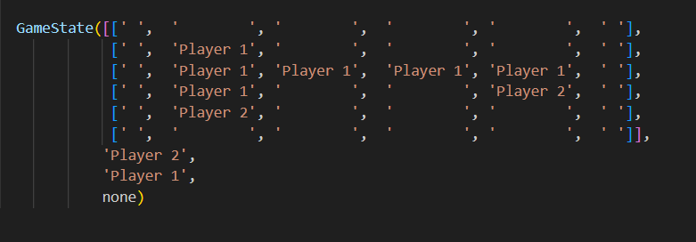

# CROSSCUT

## [Description](http://marksteeregames.com/Crosscut_rules.pdf)

> Crosscut is a two-player game played on a square board, size
> 10x10 or smaller\*, initially empty. Double sided discs, red on one side and blue on
> the other, are used. The two players, Red and Blue, take turns placing their own
> discs (discs showing their color) on the board, one disc per turn, starting with Red.
> If you have a placement available, you must make one. If you don’t have a placement
> available, your turn is skipped. Mark Steere designed Crosscut in June 2023.

## Team

Group: &nbsp;&nbsp;`Crosscut_7`

<table>
<tr><th>Nome</th><th>Número mecanográfico</th><th>Contribuição</th></tr>
<tr><td>Diogo Tomás Valente Fernandes</td><td>up202108752</td><td>9999999%</td></tr>
<tr><td>Hélder Gabriel Silva Costa</td><td>up202108719</td><td>9999999%</td></tr>
</table>

## Installation and Execution

To install and run the game, you need to download and unzip the files in

> PFL_TP1_T06_Crosscut_7.zip.

Then, you need to run the command

> make run

from the terminal in the main directory.
SICStus Prolog 4.8 needs to be installed to run the game. If you d

## Game Description

**Crosscut** is a two-player game played on a square board, size
10x10 or smaller\*, initially empty. Double-sided discs, yellow on one side and magenta on
the other, are used. The two players, **Yellow** and **Magenta**, take turns placing their
discs (discs showing their color) on the board, one disc per turn, starting with Yellow.
If you have a placement available, you must make one. If you don’t have a placement available, your turn is skipped. The goal is to make a segment from one side of the board to the other (vertically or horizontally) excluding the borders. The segment must have (Board Size - 2) pieces.
There are a few extra rules including:

1. Pieces can be placed in all unoccupied spots except the borders.
2. When you surround an opponent segment with 2 of your pieces, the pieces will flip becoming yours. This is called **flipping**. You are allowed to place a piece on the border temporarily if that allows you to make a flipping move.
3. Flipping is only doable if it doesn't cut a bigger enemy segment than the one you are trying to flip.

For visual representations and further details on the game rules please visit the following link. Development was entirely based on the rules posted

[Detailed Game Rules](http://marksteeregames.com/Crosscut_rules.pdf)

_Game development was entirely based on the rules presented on the previous website._

### Internal Game State

Our game state, GameState, used in almost all predicated is a list of 4 elements:

> Board
>
> > A square matrix whose size is based on user input and the start of the game. Initially empty, but later will contain atoms representing the players' pieces _(Player 1, Player 2, Computer 1, Computer 2)_.
>
> CurrentPlayer
>
> > The player that needs to play, may vary between _(Player 1, Player 2, Computer 1, Computer 2)_
>
> Opponent
>
> > The CurrentPlayer's opponent, will vary but _Player 1_ can never face _Computer 1_ and _Player 2_ can never face _Computer 2_
>
> Difficulty
>
> > This value is only used if one of the players involved is the computer. It may be 1,2 or none corresponding to _Easy_, _Hard_ and not used due to no bot player.
>
>  
>  

Every time a player makes a move we evaluate the resulting game state and its possible conclusion with the **game_over/2** predicate.

These are some representations of the game state during different parts of the game.

> Initial game state

> Mid game state

> Final game state

### Game State Visualization

In all our menus we use the predicate **options_menu/2** that represents the passed arguments inside a frame for beauty aspects only.

When a user opens the game he's presented with the main menu **main_menu/1** that allows the user to proceed to game or to a How To Play tab.

All the user's choices are based on number choices secured by the **get_int/3** predicate, this predicate only allows the user to input valid numbers.

//imagem do main menu

//Maybe do how to play ??

In case the user choosed to play, he will be presented with several menus that will allow him to configure the game he will play, including size _(from 5x5 to 10x10)_, mode _(P vs P, P vs AI, AI vs P, AI vs AI)_ and difficulty _(Easy or Hard)_. All these are invoked from the **play_menu/1** predicate and make use of **get_int/3**.

//imagens dos menus de configuração

//imagem do get_int ?

After, the config chosen is passed to the **initial_state/2** predicate that creates the board.

The board is then displayed after every move is made and once when the game. This is triggered by the **display_game/1** predicate.

//imagem do display_game

The **display_top_indexes/1** display only a visual helper while **display_rows/3** is responsible for displaying all the rows including all pieces. It calls a **display_piece/1** predicate responsible for printing the piece in the color associated to the current player.

//imagem do display rows
//imagem do display piece ??

### Move Validation and Execution

## Game Logic
