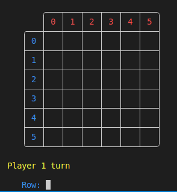
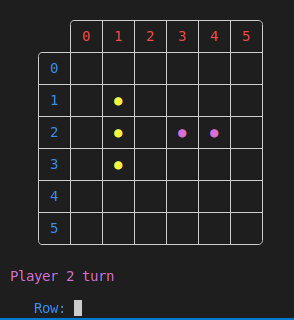
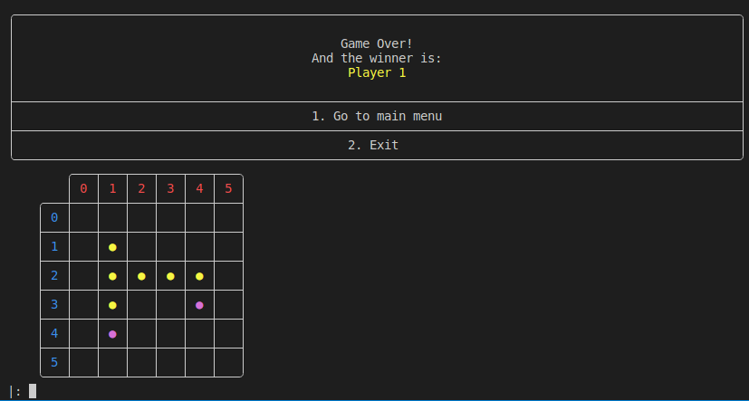
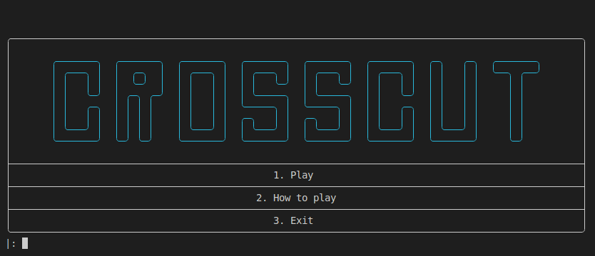
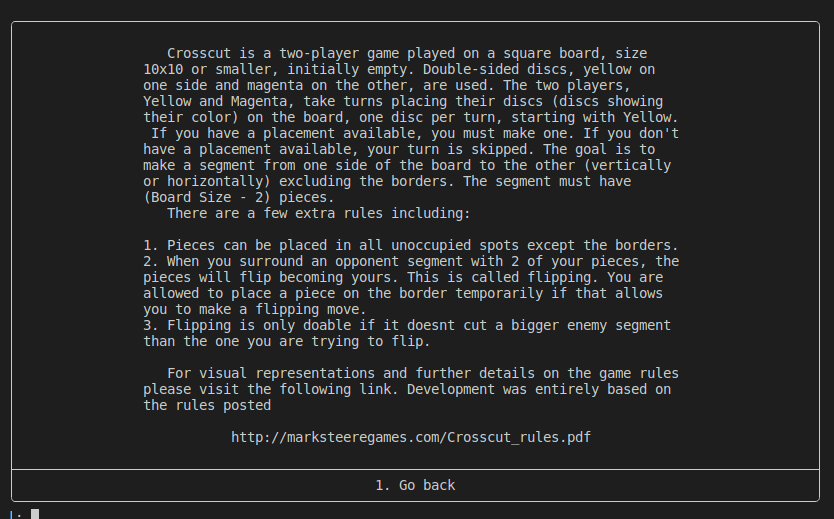

# CROSSCUT

## [Description](http://marksteeregames.com/Crosscut_rules.pdf)

> Crosscut is a two-player game played on a square board, size
> 10x10 or smaller\*, initially empty. Double sided discs, red on one side and blue on
> the other, are used. The two players, Red and Blue, take turns placing their own
> discs (discs showing their color) on the board, one disc per turn, starting with Red.
> If you have a placement available, you must make one. If you don’t have a placement
> available, your turn is skipped. Mark Steere designed Crosscut in June 2023.

## Team

Group: &nbsp;&nbsp;`Crosscut_7`

<table>
<tr><th>Nome</th><th>Número mecanográfico</th><th>Contribuição</th></tr>
<tr><td>Diogo Tomás Valente Fernandes</td><td>up202108752</td><td>50%</td></tr>
<tr><td>Hélder Gabriel Silva Costa</td><td>up202108719</td><td>50%</td></tr>
</table>

## Installation and Execution

### Linux

1. To install and run the game, you need to download and unzip the files in

   > PFL_TP1_T06_Crosscut_7.zip

2. Then, in the make file, replace `/usr/local/sicstus4.8.0/bin/sicstus` with the command you use to run Sicstus on your shell, if needed

3. Run the following command on your terminal:

   > make run

### Windows

1. To install and run the game, you need to download and unzip the files in

   > PFL_TP1_T06_Crosscut_7.zip

2. Open a Windows Shell

3. Run the following command:

   > `{Path to your sicstus.exe file}` -l `{Path to the downloaded windows.pl}`

   Example:

   ```
   "C:\Program Files\SICStus Prolog VC16 4.8.0\bin\sicstus.exe" -l C:\Users\diogo\OneDrive\Documents\feup-pfl-project1\windows.pl
   ```

4. You can also consult the `windows.pl` file directly from the Sicstus Prolog Interpreter.

---

**`Warning:`** SICStus Prolog 4.8 needs to be installed to run the game.

## Game Description

**Crosscut** is a two-player game played on a square board, size
10x10 or smaller\*, initially empty. Double-sided discs, yellow on one side and magenta on
the other, are used. The two players, **Yellow** and **Magenta**, take turns placing their
discs (discs showing their color) on the board, one disc per turn, starting with Yellow.
If you have a placement available, you must make one. If you don’t have a placement available, your turn is skipped. The goal is to make a segment from one side of the board to the other (vertically or horizontally) excluding the borders. The segment must have (Board Size - 2) pieces.
There are a few extra rules including:

1. Pieces can be placed in all unoccupied spots except the borders.
2. When you surround an opponent segment with 2 of your pieces, the pieces will flip becoming yours. This is called **flipping**. You are allowed to place a piece on the border temporarily if that allows you to make a flipping move.
3. Flipping is only doable if it doesn't cut a bigger enemy segment than the one you are trying to flip.

For visual representations and further details on the game rules please visit the following link. Development was entirely based on the rules posted

[Detailed Game Rules](http://marksteeregames.com/Crosscut_rules.pdf)

_Game development was entirely based on the rules presented on the previous website._

## Game Logic

### Internal Game State

Our game state, GameState, used in almost all predicated is a list of 4 elements:

> Board
>
> > A square matrix whose size is based on user input and the start of the game. Initially empty, but later will contain atoms representing the players' pieces _(Player 1, Player 2, Computer 1, Computer 2)_.
>
> CurrentPlayer
>
> > The player that needs to play, may vary between _(Player 1, Player 2, Computer 1, Computer 2)_
>
> Opponent
>
> > The CurrentPlayer's opponent, will vary but _Player 1_ can never face _Computer 1_ and _Player 2_ can never face _Computer 2_
>
> Difficulty
>
> > This value is only used if one of the players involved is the computer. It may be 1,2 or none corresponding to _Easy_, _Hard_ and not used due to no bot player.
>
> <br>
> </br>

Every time a player makes a move we evaluate the resulting game state and its possible conclusion with the `game_over/2` predicate.

These are some representations of the game state during different parts of the game.

> Initial game state

|                     Board Display                      |                           Game State                            |
| :----------------------------------------------------: | :-------------------------------------------------------------: |
|  |  |

> Mid game state

|                   Board Display                   |                         Game State                         |
| :-----------------------------------------------: | :--------------------------------------------------------: |
|  |  |

> Final game state

|                     Board Display                     |                           Game State                           |
| :---------------------------------------------------: | :------------------------------------------------------------: |
|  |  |

### Game State Visualization

In all our menus we use the predicate `options_menu/2` that represents the passed arguments inside a frame for beauty aspects only.

the theonWhen a user opens the game he's presented with the main menu **main_menu/1** that allows the user to proceed to the game or to a How To Play tab.

All the user's choices are based on number choices secured by the `get_int/3` predicate, this predicate only allows the user to input valid numbers.

|                Main Menu                 |                   How to Play Menu                   |
| :--------------------------------------: | :--------------------------------------------------: |
|  |  |

In case the user chooses to play, he will be presented with several menus that will allow him to configure the game he will play, including size _(from 5x5 to 10x10)_, mode _(P vs P, P vs AI, AI vs P, AI vs AI)_ and difficulty _(Easy or Hard)_. All these are invoked from the **play_menu/1** predicate and make use of `get_int/3`.

```prolog
get_int(N):-
    get_int(0, N).

get_int(N, Bottom, Top):-
    get_int(0, Input),
    (between(Bottom, Top, Input) -> N = Input; get_int(N, Bottom, Top)).

get_int(N, N):-
    peek_code(10),
    get_code(10),
    !.

get_int(Current, Result):-
    get_code(Input),
    between(48, 57, Input),
    New is Current * 10 + (Input - 48),
    get_int(New, Result).
```

After, the config chosen is passed to the `initial_state/2` predicate that creates the board.

The board is then displayed after every move is made and once when the game. This is triggered by the **display_game/1** predicate.

```prolog
display_game(Board):-
    length(Board, Size),
    display_top_indexes(Size),
    display_rows(Board, 0, Size).
```

The **display_top_indexes/1** displays only a visual helper while `display_rows/3` is responsible for displaying all the rows including all pieces. It calls a **display_piece/1** predicate responsible for printing the piece in the color associated with the current player.

```prolog
display_rows([H], N, Size):-
    Size1 is Size - 1,
    write('    │\x[94m '), write(N), write('\x[0m │'),
    display_row(H),
    write('    ╰───┴'), write_n_times('───┴', Size1), write('───╯\n').
display_rows([H|B], N, Size):-
    Size1 is Size - 1,
    N1 is N + 1,
    write('    │\x[94m '), write(N), write('\x[0m │'),
    display_row(H),
    write('    ├───┼'), write_n_times('───┼', Size1), write('───┤\n'),
    display_rows(B, N1, Size).
display_row([H]):-
    display_piece(H), write('│\n').
display_row([H|B]):-
    display_piece(H), write('│'),
    display_row(B).
```

```prolog
display_piece('Player 1') :- write('\x[93m ● \x[0m').
display_piece('Player 2') :- write('\x[95m ● \x[0m').
display_piece('Computer 1') :- write('\x[93m ● \x[0m').
display_piece('Computer 2') :- write('\x[95m ● \x[0m').

display_piece('bp1') :- write('\x[5;93m ● \x[0m').
display_piece('bp2') :- write('\x[5;95m ● \x[0m').
display_piece('bc1') :- write('\x[5;93m ● \x[0m').
display_piece('bc2') :- write('\x[5;95m ● \x[0m').

display_piece('_') :- write('\x[5;91m _ \x[0m').
display_piece(' ') :- write('   ').
```

### Move Validation and Execution

The game is based on the cycle invoked in the predicate `play/3`.

```prolog
play:-
    main_menu(Input),
    (
        Input == 1 -> (
            play_menu(Config),
            initial_state(Config, Init),
            play(Init, [Init], States),
            reverse(States, Path), write(Path),
            play
        );
        Input == 2 ->(
            rules_menu,
            play
        );
        Input == 3 ->(
            exit_menu(Exit_Input),
            Exit_Input == 2 -> play ; cls, halt
        )
    ).

play(Curr, Path, Path):-
    final(Curr),
    !.

play(Curr, Path, States):-
    game_state_pack(Curr, Board, CurrentPlayer, Opponent, Difficulty),
    display_game(Board),
    move(Curr, S1),
    switch_current_player(S1, Next),
    cls,
    not( member(Next, Path) ),
    play(Next, [Next|Path], States).
```

It displays the current board and then asks the user for a set of coordinates through the `move/2` that then calls the `valid_move/2`, the last predicate is the one that inquires the user and checks if the move in question is valid.

```prolog
valid_move(Move, State, NewState):-
    game_state_pack(State, Board, _, _, _),
    length(Board, Size),
    Size1 is Size - 1,
    Move \= 0-X, Move \= Size1-X, Move \= X-0, Move \= X-Size1,
    mx_get(Move, Board, ' '),
    update_board(State, Move, S1),
    check_flanking(Move, S1, NewState, 0).

valid_move(Move, State, NewState):-
    game_state_pack(State, Board, _, _, _),
    length(Board, Size),
    Size1 is Size - 1,
    Move = Row-Column,
    (Row == 0; Row == Size1; Column == 0; Column == Size1),
    check_flanking(Move, State, NewState, 1),
    State \= NewState.
```

A move will be considered valid if:

1. Is within the playing area
2. Is played in an empty coordinate
3. If played on the borders of the board allows for a flanking move

After it is considered valid and after checking for all possible flankings resulting from such a move, the board is updated with the predicate `update_board/3`.

```prolog
update_board(State, Move, NewState):-
    Move = (Row-Column),
    game_state_pack(State, Board, CurrentPlayer, Opponent, Difficulty),
    place_disc(Row, Column, CurrentPlayer, Board, NewBoard),
    game_state_pack(NewState, NewBoard, CurrentPlayer, Opponent, Difficulty).
```

### End of Game

After the board is updated the resulting _GameState_ is then checked to see if a winning condition has been reached (`game_over/2`). If so, then a winner menu (`winner_menu/2`) is displayed as well as the final board.

```prolog
game_over(State, Winner):-
    game_state_pack(State, Board, _, Opponent, _),
    (check_rows(Opponent, Board) ; check_columns(Opponent, Board)),
    Winner = Opponent.
```

### Game State Evaluation

The game state is evaluated with the `value/2` predicate. This predicate is used by the computer to evaluate the current game state and decide which move to make.
This predicate relies on 2 other predicates, `get_largest_segment/3` and `count_pieces/3`. The first one is used to get the largest segment of a player in the current game state and the second one is used to count the number of pieces of a player in the current game state.
By using these 2 predicates we can evaluate the current game state and give it a value. The higher the value, the better the game state is for the computer.
The first predicate below is a special case for when the game is over. In this case, 10 extra points are added to boost the value of the game state.

```prolog
value(State, Value):-
    switch_current_player(State, NewState),
    game_over(NewState, Winner), !,
    game_state_pack(State, Board, CurrentPlayer, Opponent, _),
    get_largest_segment(Board, CurrentPlayer, PlayerMaxSeg),
    get_largest_segment(Board, Opponent, OpponentMaxSeg),
    count_pieces(Board, CurrentPlayer, PlayerPieces),
    count_pieces(Board, Opponent, OpponentPieces),
    Value is 10 + PlayerMaxSeg * 2 - OpponentMaxSeg * 2 + PlayerPieces - OpponentPieces.
    Value = 10.

value(State, Value):-
    game_state_pack(State, Board, CurrentPlayer, Opponent, _),
    get_largest_segment(Board, CurrentPlayer, PlayerMaxSeg),
    get_largest_segment(Board, Opponent, OpponentMaxSeg),
    count_pieces(Board, CurrentPlayer, PlayerPieces),
    count_pieces(Board, Opponent, OpponentPieces),
    Value is PlayerMaxSeg * 2 - OpponentMaxSeg * 2 + PlayerPieces - OpponentPieces.
```

### Computer Plays

The computer moves are decided by the `best_move/3` predicate. This predicate has two variants. The first one is used when the computer is playing in easy mode and the second one is used when the computer is playing in hard mode.
The easy mode only generates all the possible moves and picks one randomly.
The hard mode relies on the minimax algorithm `best_move/3` to decide which move to make. The depth of the minimax algorithm is decided according to the size of the board. The smaller the board, the deeper the minimax algorithm goes to make the game faster.

```prolog
choose_move(State, Player, Move):-
    game_state_pack(State, _, _, _, 1),
    valid_moves(State, ListOfMoves),
    random_member(Move, ListOfMoves).

choose_move(State, Player, BestMove):-
    game_state_pack(State, Board, _, _, 2),
    length(Board, Size),
    (
        (Size == 10; Size == 9; Size == 8) -> Depth = 2;
        Size == 7  -> Depth = 3;
        Size == 6  -> Depth = 4;
        Size == 5  -> Depth = 6
    ),
    best_move(State, BestMove, Depth).
```

## Conclusion

The Crosscut game was successfully implemented in Prolog. It can be played in the 4 modes suggested Player vs Player, Player vs Computer, Computer vs Player and Computer vs Computer with board sizes ranging from 5x5 to 10x10, as anything above that is not recommended by the creator due to possible deadlock issues. We think our game does not have any limitations and is implemented correctly and robustly.

For us, the most challenging parts were the start as we had no experience with Prolog and it's not an easy programming language to get started with as well as the development of the greedy algorithm for smart AI plays. It served as a good way to consolidate and practice the skills acquired in the theoretical and practical classes.

## Bibliography

> [http://marksteeregames.com/Crosscut_rules.pdf](http://marksteeregames.com/Crosscut_rules.pdf)
>
> [https://silp.iiita.ac.in/wp-content/uploads/PROLOG.pdf](https://silp.iiita.ac.in/wp-content/uploads/PROLOG.pdf)
